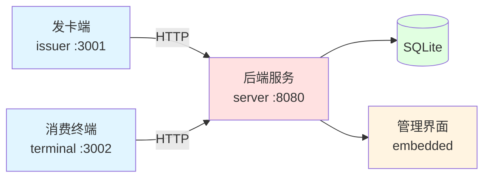

# 一卡通模拟消费终端系统

一个基于 Go 的校园一卡通模拟系统，包含发卡、消费、管理三个独立组件，使用 Docker Compose 一键部署。
---
该项目属于汕头大学一级项目 采用MIT协议
---

## 系统架构



### 核心组件

| 组件 | 端口 | 功能 |
|------|------|------|
| **server** | 8080 | HTTP API + SQLite + 管理界面 |
| **issuer** | 3001 | 发卡、充值 |
| **terminal** | 3002 | POS 风格消费终端 |

### 技术栈

- **Go 1.23** — 跨平台，编译为单二进制
- **SQLite** — 轻量级数据库
- **Vue/React** — 前端界面（`go:embed` 内嵌）
- **Docker Compose** — 容器编排

## 快速开始

### 前置要求

- Docker
- Docker Compose

### 启动服务

```bash
# 1. 克隆项目
git clone <repo-url>
cd one-card-MS

# 2. 配置环境变量
cp .env.example .env
# 编辑 .env，设置 CARD_HMAC_KEY

# 3. 启动所有服务
docker-compose up -d

# 4. 查看日志
docker-compose logs -f
```

### 访问服务

| 服务 | 地址 |
|------|------|
| 管理界面 | http://localhost:8080 |
| 发卡端 | http://localhost:3001 |
| 消费终端 | http://localhost:3002 |

## 使用流程

### 1. 发卡

访问发卡端 → 输入卡号、姓名、初始金额 → 生成卡片文件（JSON）→ 保存到本地

### 2. 消费

访问消费终端 → 输入金额 → 点击"开始扣费" → 上传卡片文件 → 自动扣款 → 下载更新后的卡片

### 3. 充值

访问发卡端 → 选择充值功能 → 输入卡号和金额 → 完成充值

### 4. 管理

访问管理界面 → 查看所有卡片、交易记录、统计数据

## 卡片文件格式

```json
{
  "card_id": "2024001",
  "name": "张三",
  "balance": 500.00,
  "status": "active",
  "expires_at": "2027-06-30T23:59:59Z",
  "transactions": [],
  "hmac": "sha256_signature"
}
```

使用 HMAC-SHA256 签名防篡改。

## 常用命令

```bash
# 启动服务
docker-compose up -d

# 停止服务
docker-compose down

# 查看日志
docker-compose logs -f

# 重新构建（代码修改后）
docker-compose up -d --build

# 备份数据库
docker cp onecard-server:/data/onecard.db ./backup.db
```

## 项目结构

```
one-card-MS/
├── server/          # 后端服务
├── issuer/          # 发卡端
├── terminal/        # 消费终端
├── docker-compose.yml
├── .env.example
└── docs/            # 详细设计文档
```

## 文档

详细设计文档请查看 [docs/specs/](docs/specs/)：

- [总体设计](docs/specs/2026-03-31-design.md)
- [后端实现方案](docs/specs/2026-03-31-server-implementation.md)
- [发卡端实现方案](docs/specs/2026-03-31-issuer-implementation.md)
- [消费终端实现方案](docs/specs/2026-03-31-terminal-implementation.md)
- [Docker 部署方案](docs/specs/2026-03-31-docker-deployment.md)

## 许可证

MIT License
